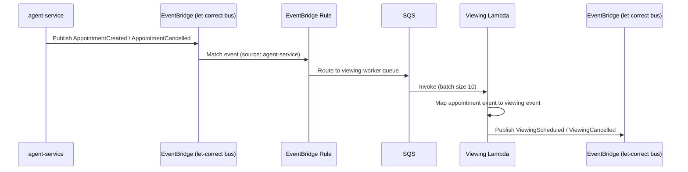

# viewing-service

This service is the Viewing domain — responsible for all viewing-related actions.

## Workflows

### 1. Processing an Appointment Event

The viewing-service subscribes to the shared `let-correct` EventBridge event bus. When agent-service publishes an `AppointmentCreated` or `AppointmentCancelled` event, an EventBridge rule routes it to the viewing-service SQS queue. The viewing Lambda processes each message, transforms the appointment into a viewing event, and publishes it back to the event bus for downstream consumption.

Failed messages are retried up to three times before being moved to the dead-letter queue. The Lambda reports batch item failures so that successful messages in a batch are not reprocessed alongside failed ones.

---

## Lambdas

### Viewing Lambda (`cmd/viewing`)

Triggered by SQS (batch size 10). Consumes `AppointmentCreated` and `AppointmentCancelled` events delivered from the `let-correct` EventBridge bus, transforms them into viewing domain events, and publishes `ViewingScheduled` or `ViewingCancelled` events back to the event bus. Failed messages are retried up to three times before being moved to the dead-letter queue.

---

## Infrastructure

- **AWS EventBridge** — subscribes to the shared `let-correct` event bus; an EventBridge rule filters `AppointmentCreated` and `AppointmentCancelled` events from `agent-service` and routes them to the viewing-service SQS queue
- **AWS SQS** — `viewing-worker` queue (batch size 10) with a dead-letter queue for messages that exceed the retry limit
- **AWS Lambda** — processes SQS messages, transforms appointment events into viewing events, and publishes them to EventBridge
- **Terraform** — all infrastructure managed as code, deployed via Terraform Cloud
